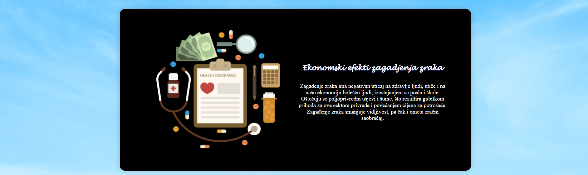

## _Home_

Korisnik prilikom pokretanja web aplikacije vidi  _Navbar_  koja se sastoji od elemenata (stranica): 

* __Home__ 
* __About__ 
* __Aqi__ 
* __Butmir__ 
* __Sensor__ 
* __Logo__ 

Na početnoj se nalazi video sa nazivom aplikacije  _Pollution Alerts_ 

----

## _About_

Ova stranica sadrži kartice sa nekim informacijama o efektima zagađenja zraka. Korisnici mogu da vide 3 crne kartice sa tekstom i slikama.

----

## _Aqi_

Na ovoj stranici korisnici imaju opciju da pretražuju kvalitet zraka za određenu državu.

U polje gdje piše  _Enter the name of the country_  korisnik unosi željenu državu. Unosom prvog slova, aplikacija izbaci spisak ponuđenih država koje sadrže to slovo. 

Kada izabere državu, korisnik klikne na  _Search_  , i tada mu aplikacija izbaci tabelu sa podacima za tu državu.

Ukoliko nema podataka za tu odabranu državu, aplikacija izbaci upozorenje  _No data for this country. Please choose other._ 

Kada korisnik pomjeri miš na ikonicu  _i_  može vidjeti značenje datih skraćenica.

----

## _Butmir_

Ova stranica sadrži lokaciju senzora koji prati  _CO2_ . Mapa je povezana putem mapbox-a.

----

## _Sensor_

Ova stranica sadrži grafike koji prikazuju podatke koje je senzor sakupio za mjesece decembar i januar.

Povlačenjem miša na neki od čvorova, izbaci se kartica sa datumom i vrijednosti  _CO2_ .

