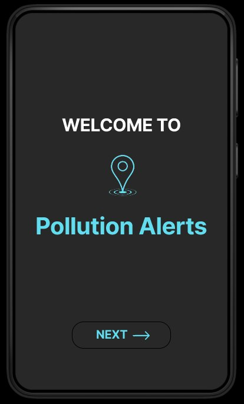
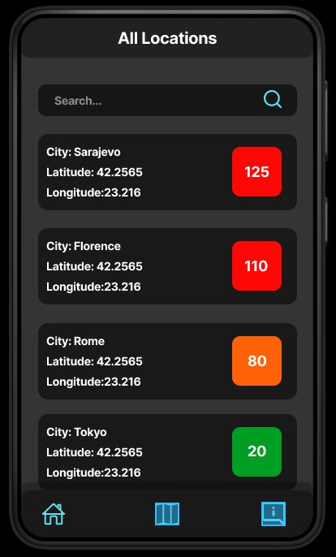
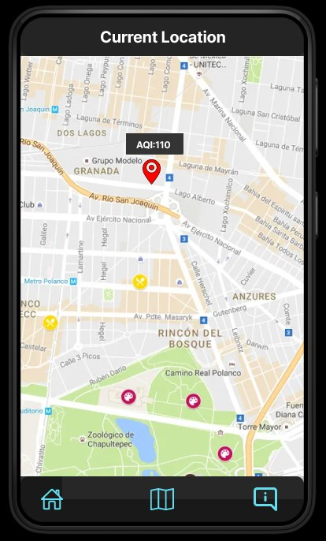
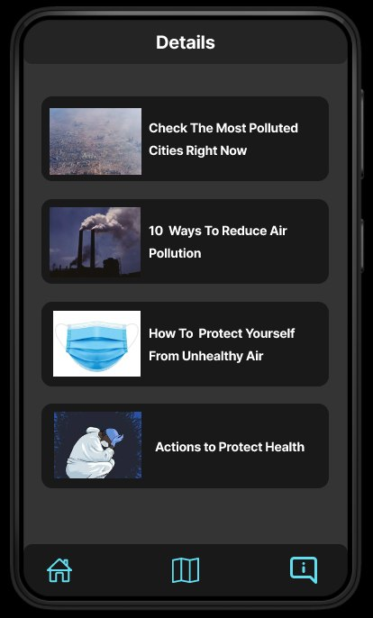
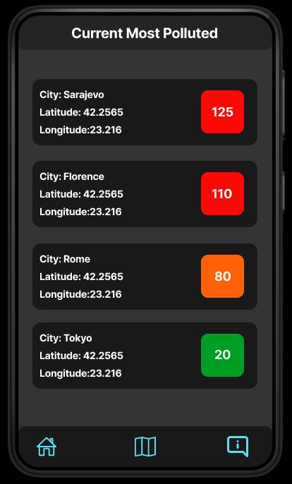

## _Welcome_

Kada korisnik otvori mobilnu aplikaciju prikazat će mu se početna stranica sa nazivom aplikacije _Pollution Alerts_  i sa logom.

Klikom na button  _Next_  prelazi na narednu stranicu.

----

## _All Locations_

Korisnik na ovoj stranici može vidjeti sve dostupne stanice sa njihovom lokacijom, sa njihovim aqi-jem.

Ima opciju   _Search_  da pretražuje neku određenu lokaciju.

Na dnu stranice je  _Navbar_  koja se sastoji od elemenata (stranica):

* __All Locations__ 
* __Current Location__ 
* __Details__ 

----

## _Current Location_

Kada se prvi put pokrene na uređaju, traži se pristup geolokaciji i kada se omogući, može se vidjeti trenutni stepen zagađenja na određenoj lokaciji.

----

## _Details_

Otvaranjem ove stranice korisnik može vidjeti kartice sa dodatnim informacijama zaštite, prevencije itd.

----

## _Current Most Polluted_

Otvaranjem stranice korisnik može vidjeti kako su rankirani gradovi, počevši od najzagađenijeg.

